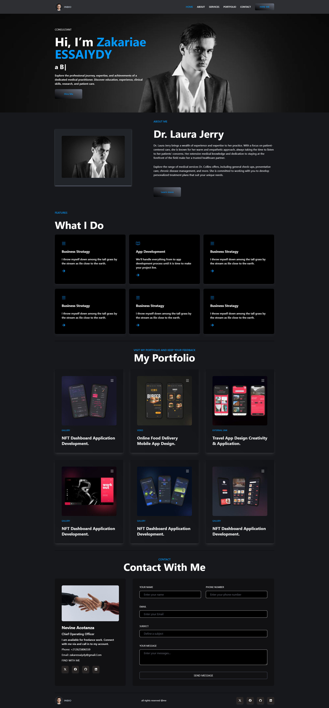

# React Portfolio

This is a personal portfolio project built with React, TypeScript, and Tailwind CSS. The project is hosted on GitHub Pages and showcases various sections such as Home, About, Services, Portfolio, and Contact.

## Table of Contents

- [Demo](#demo)
- [Features](#features)
- [Installation](#installation)
- [Scripts](#scripts)
- [Dependencies](#dependencies)
- [Development](#development)
- [Deployment](#deployment)
- [License](#license)

## Demo

You can view the live project here: [React Portfolio](https://zaki-essay.github.io/react-portfolio/)

## Features

- Responsive design using Tailwind CSS.
- Smooth scrolling navigation.
- Dynamic content rendering with React and React Router.
- Typewriter effect using `react-simple-typewriter`.
- Deployed using GitHub Actions.

## Installation

1. Clone the repository:

    ```bash
    git clone https://github.com/Zaki-Essay/react-portfolio.git
    cd react-portfolio
    ```

2. Install dependencies:

    ```bash
    npm install
    ```

## Scripts

- `dev`: Start the development server using Vite.
- `build`: Build the project for production.
- `lint`: Run ESLint to analyze code quality.
- `preview`: Preview the production build.

## Dependencies

### Main Dependencies

- **React**: `^18.3.1`
- **React DOM**: `^18.3.1`
- **React Icons**: `^5.3.0`
- **React Router DOM**: `^6.26.1`
- **React Simple Typewriter**: `^5.0.1`

### Dev Dependencies

- **@vitejs/plugin-react**: `^4.3.1`
- **Autoprefixer**: `^10.4.20`
- **ESLint**: `^9.9.0`
- **PostCSS**: `^8.4.41`
- **Tailwind CSS**: `^3.4.10`
- **TypeScript**: `^5.5.3`
- **TypeScript ESLint**: `^8.0.1`
- **Vite**: `^5.4.1`

## Development

To start the development server, run:

```bash
npm run dev
```

### Summary:

- **Installation Instructions**: The README provides clear steps to set up and run the project locally.
- **Deployment**: Automated deployment is configured with GitHub Actions, ensuring that any changes pushed to the `main` branch are built and deployed to GitHub Pages.
- **Dependencies**: The README lists both main and dev dependencies for easy reference.

